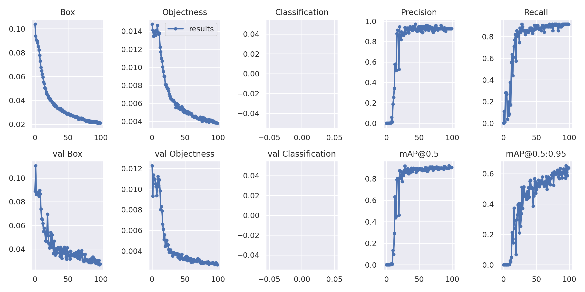

# Satellite Tip Detection

## Demo Video

***coming soon***

<!-- ABOUT THE PROJECT -->
## About The Project

For this project I was tasked with detecting the tip of a satellite. The tip of a satellite is an important part of the docking mechanism that the satellite uses and often needs monitoring from humans which could also be a cause for human error in satellite docking. I chose to automate this process using the YOLO model architecture to automatically detect the satellite tip. The YOLO model architecture (You Only Look Once) deals with object detection in a different way. It takes the entire image in a single instance and predicts the bounding box coordinates and class probabilities for these boxes. The biggest advantage of using YOLO is its superb speed – it’s incredibly fast and can process 45 frames per second. My object detection task in particular with my limited computation resources processed 87 images in about 3 seconds giving us a framerate of almost 30 frames per second!

Here are some resources I used to build YOLO and learn about it:

* [YOLO Explained (medium)](https://towardsdatascience.com/yolo-you-only-look-once-real-time-object-detection-explained-492dc9230006)
* [Original YOLO paper](https://arxiv.org/abs/1506.02640)
* [YOLOV5 Docs](https://docs.ultralytics.com/)

## Dataset used:

[https://nexus.spaceapplications.com/repository/raw-km/infuse/infuse-dl-dataset-v0.0.7-rand-eval.tar.gz](https://nexus.spaceapplications.com/repository/raw-km/infuse/infuse-dl-dataset-v0.0.7-rand-eval.tar.gz)

I used Roboflow to make my dataset. This includes annotating the data by hand, applying transformations, and pre-processing the data into YoloV5 form. I could not make the code I used for downloading the dataset in my YoloV5.ipynb notebook public due to privacy issues as well. But you can download the dataset from this repository.
 

## Results: 
Input: *Check YoloV5-Satellite.ipynb*
Output: *Check YoloV5-Satellite.ipynb*

All Predictions: 

## Training:

I trained both the YoloV3 from scratch and YoloV5 pretrained and the YoloV5 had better performance by far (I cannot release the YoloV3 Satellite dataset as well due to privacy issues):




These are my results from training the YoloV5 model for 100 epochs.

### Built With

* [YoloV5 PyTorch](https://pytorch.org/hub/ultralytics_yolov5/)
* [PyTorch](https://pytorch.org/)
* [RoboFlow](https://roboflow.ai/)

I used the pre-trained YoloV5 architecture made by PyTorch and Ultralytics and in addition to that I chose to implement my own YoloV3 model in PyTorch with the help of Aladdin Perrson's YoloV3 from scratch implementation on youtube.


<!-- GETTING STARTED -->
## Getting Started
* *To get started download bestYOLO.pt from my repository, these are the weights for the trained model*
* *Load the bestYOLO.py file into whatever notebook you are using and run MinimalExample.ipynb in Google Colaboratory or Jupyter Notebook*
* *or just follow directions in the notebook and demo video*
* *Wait for images to be generated*


### Prerequisites for YoloV3

This is an example of how to list things you need to use the software and how to install them (if you are using the notebook you do not need to install).
* pytorch:
  ```pip install pytorch```
* tqdm:
  ```pip install tqdm```
* Albumentations:
  ```pip install albumentations```
* pandas:
  ```pip install pandas```
* numpy:
  ```pip install numpy```
* matplotlib:
  ```pip install matplotlib```

Training the YoloV3 model from scratch is not recommended as it takes a lot of time and produces sub par results compared to pre-trained YoloV5.
